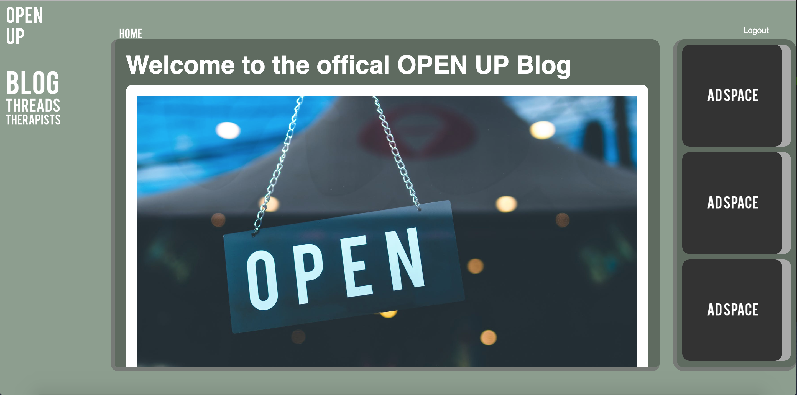
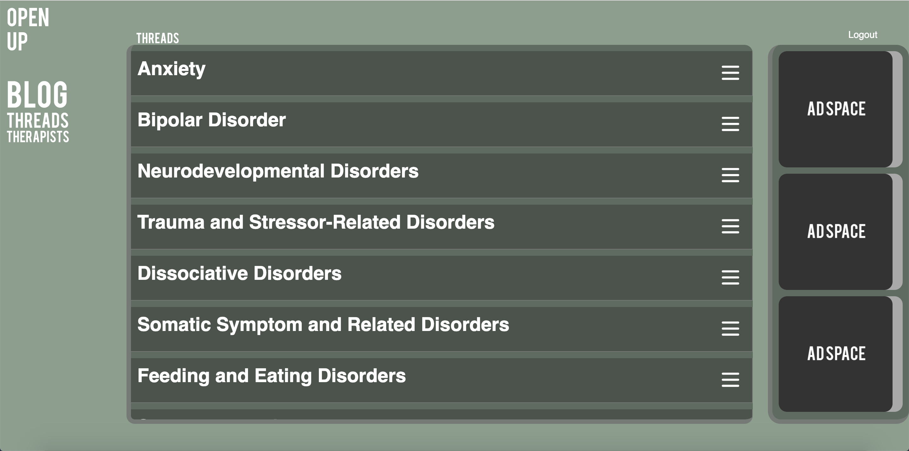

# Open-Up-App

Online Anonymous social space for people with mental health problems.

# App Summary
   Open Up is an anonymous online social space intended for users with mental health disorders. It provides the user with
the freedom to express themselves and get advice from others without having to show their identity if so they choose. The user will have access to public threads categorized by mental disorders where they can post and interact with other users. They will also have access to a public site blog that provides information and sources on mental health care. The user will be required to sign up with a email and password and choose a display name to gain access to the app. 

## Available Features
  * Sign Up for account
  * Sign In with email and password
  * Create display name
  * View blog
  * View threads
  * Post in thread
  * Delete your thread post
  * Like thread posts
 -see bottom of page for features in development

## Live Site
https://open-up-app.herokuapp.com/

Feel free to sign up for an account or use the demo account info below.

##### Demo email: 
openupdemo@gmail.com

##### Demo password: 
openup123

## Live Site Screenshots:

## TECHNOLOGY STACK

### FRONT-END TECHNOLOGIES:
* JavaScript
* CSS
* HTML
* jQuery
* EJS

### SERVER TECHNOLOGIES:
* Node JS
* Express
* MongoDB

### CONTINUOUS INTEGRATION:
* Mocha/Chai

### DEVELOPMENT/DEPLOYMENT:
* Git & GitHub
* Heroku
* Travis CI

### IN DEVELOPMENT
* Therapist browser
* Therapist profiles
* User profiles
* Friend list
* Friend and therapist messaging
* Commenting on posts
* Report system for posts and users
* Real friend requests

 and more..
